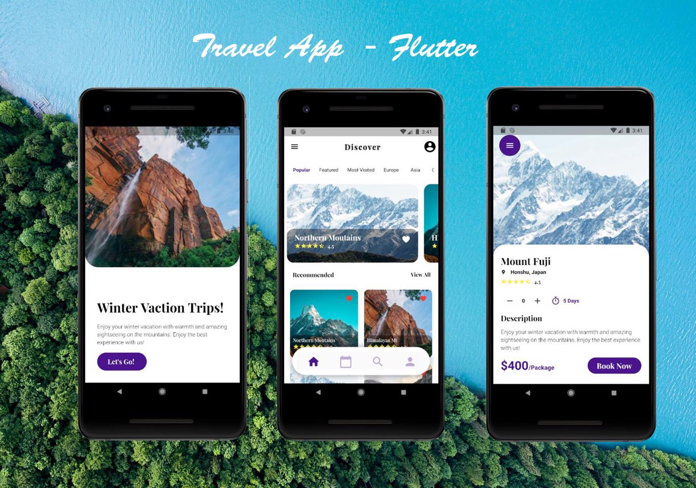

# Travel App UI Design

Travel Application UI Design.  
This repository is an mobile application developed in Flutter base of the design of  
Al Razi Siam  https://www.behance.net/gallery/111883599/Travel-App  
  
  I have tried to recreate the above design with few changes.
## Screenshot  
Shown UI might change with updates given to UI.  
  

## Pages Included
### Splashscreen  
There is very simple splash screen that display in introduction text with a call to action button.
Currently this will appear on every launch but can be changed with few changes.  
This page can also be used to show anu featured discounts or new arrivals at the launch of the app.

### Homepage
This page contains all the travel packages and details about them. This page has statemanagement built with the provider package. Have added dummy data with fake delay to replicate fetching of API calls and API call can be made from `.\lib\utils\restAPI.dart`.  
Places models are in `.\lib\models\placesModel.dart`, and need to edited to include the JSON for the required API calls.  

Bottom Nav bar is a dynamic nav bar thar responds to user's scroll inputs and hides and shows itselft upon scrolls.

### View Details Page
This page contains the details about a specific selected page. The data selected from previous page is not currently forwarded to this page. This can also be done with a few changes in future.

## Usage Instructions
The reposistory is free to use.
